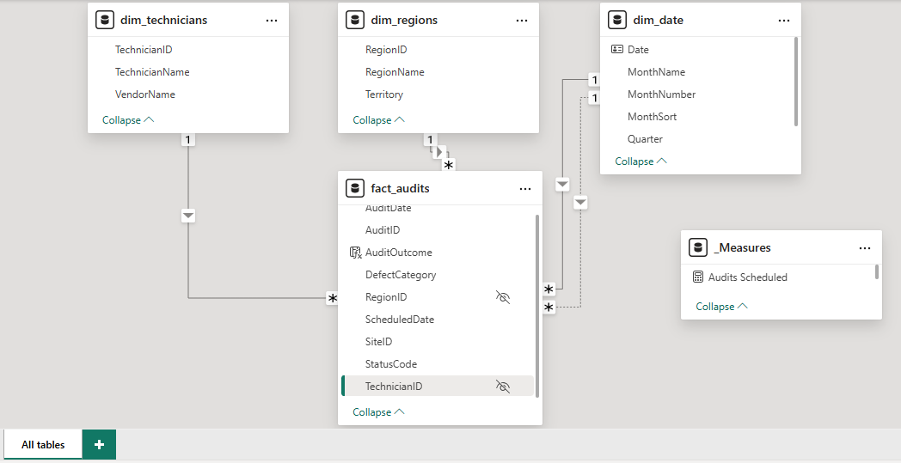
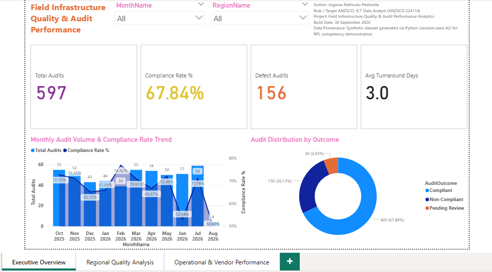
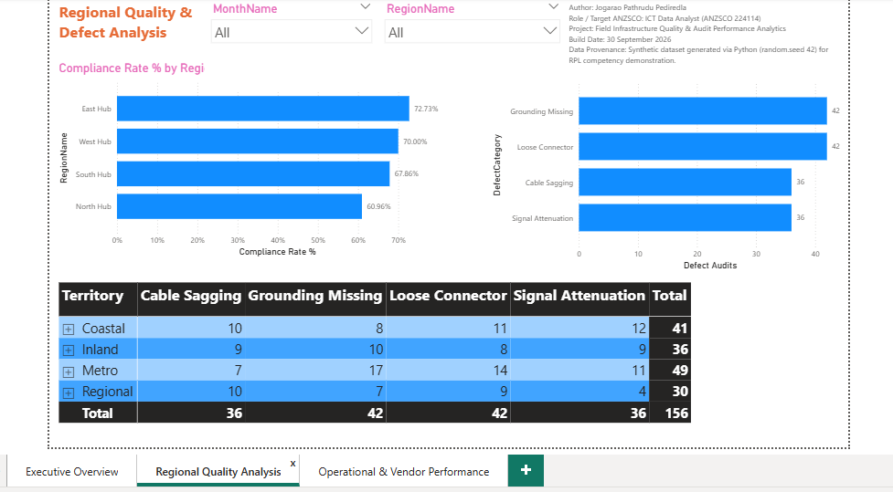
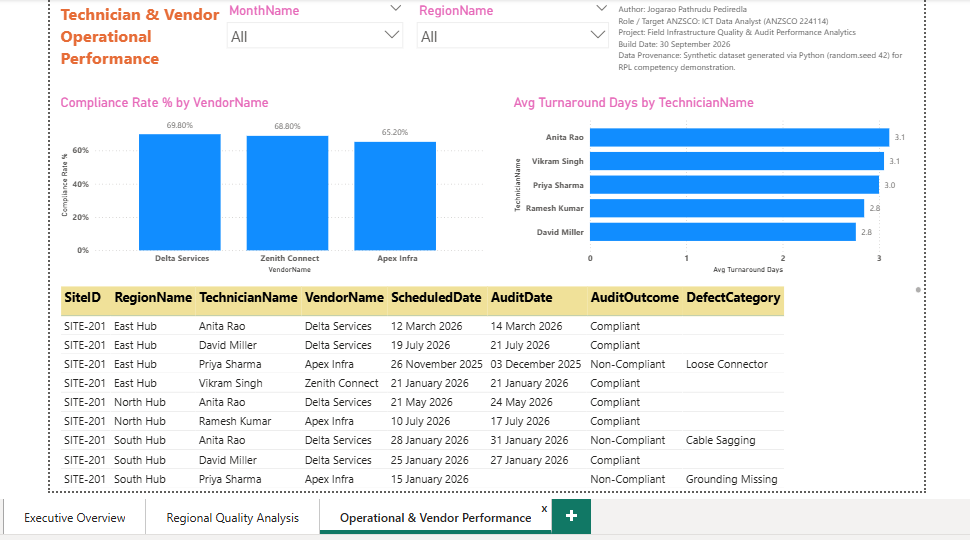

# Field Infrastructure Quality & Audit Performance Analytics

[-blue.svg)](#target-anzsco-competency-mapping)
[-green.svg)](#target-anzsco-competency-mapping)
[-orange.svg)](#target-anzsco-competency-mapping)
[](#semantic-model--key-dax-measures)
[](#database-schema--reporting-views)
[](#exploratory-data-analysis--validation-output)

An end-to-end telecommunications field audit analytics and quality governance pipeline engineered with Python data generation, MySQL relational schemas, and a Kimball star-schema Power BI semantic model.

---

## Metadata & Attribution

* **Author:** Jogarao Pathrudu Pediredla
* **GitHub Profile:** [@PJPathrudu](https://github.com/PJPathrudu)
* **Target ANZSCO Occupations:** 
  * **224114** — Data Analyst
  * **263211** — ICT Quality Assurance Engineer
  * **261111** — ICT Business Analyst
* **Assessment Framework:** ACS RPL Skills Assessment Evidence (Category 2 — Attributed Work)

---

## Project Overview

This analytics pipeline models an end-to-end ICT quality verification and decision-support architecture across field engineering operations:
1. **Business Systems Analysis (ANZSCO 261111):** Formulates operational business logic, normalizes fragmented compliance codes, and evaluates architectural trade-offs between flat reporting views and relational star schemas.
2. **Quality Assurance Engineering (ANZSCO 263211):** Implements multi-tier test data gating, enforces defect taxonomies, monitors contractor turnaround latency, and evaluates SLA non-conformance.
3. **Data Analytics & Modeling (ANZSCO 224114):** Ingests, profiles, and validates transactional data using Python, structures normalized 3NF MySQL schemas, and designs an import-mode Kimball star-schema semantic model in Power BI.

---

## Data Provenance & Synthetic Disclosure

All transactional records are synthetically generated using Python (`random.seed(42)` and `numpy.random.seed(42)`) to simulate field audit lifecycles without using proprietary corporate data:

* **Deterministic Reproduction:** Fixed random seeds guarantee identical row outputs across any execution environment.
* **Operational Integrity:** Audits marked `PENDING` enforce `NULL` execution dates, while completed audits enforce turnaround delays between 0 and 7 days.
* **Quality Assurance Test Cases:** Embeds 3 test records (`IsTestRecord = 1`) to validate downstream data cleansing rules, sanitization gates, and filter integrity.

---

## Repository Structure

```text
field-infrastructure-audit-analytics/
├── data/
│   ├── dim_regions.csv               # Region dimension (4 records)
│   ├── dim_technicians.csv           # Technician & vendor dimension (5 records)
│   └── fact_audits.csv               # Audit transactions (600 records)
├── docs/
│   └── screenshots/                  # Architecture & visual reporting evidence
│       ├── 01_star_schema_model.png   # Tabular star schema model relationships
│       ├── 02_executive_overview.png  # Executive KPI & monthly trend dashboard
│       ├── 03_regional_quality.png    # Regional compliance & defect category matrix
│       └── 04_operational_details.png # Vendor compliance & turnaround latency details
├── pbix/
│   └── Field_Audit_Analytics.pbix    # Tabular model with embedded cache
├── sql/
│   └── 01_schema_and_views.sql       # DDL, bulk loading, and operational views
├── src/
│   └── data_pipeline_and_eda.ipynb   # Deterministic generator & quality profiling
├── .gitignore
└── README.md
```

---

## System Architecture & Visual Reports

### 1. Tabular Star Schema Architecture (VertiPaq Import Model)


### 2. Operational & Executive Quality Dashboard


### 3. Regional Quality & Defect Distribution


### 4. Technician & Vendor Operational SLA Performance


---

## Business Requirements & Process Analysis (ANZSCO 261111 Alignment)

* **Business Problem Definition:** Field audits across regional telecommunication nodes suffered from disparate status codes recorded across contractor systems (`PASS`, `PASSED`, `FAIL`, `FAILED`, `REJECTED`, `PENDING`), preventing centralized SLA monitoring.
* **Functional Requirements (FR):**
  * *FR-01 (Normalization):* Classify disparate operational statuses into binary compliance states (`Compliant` vs. `Non-Compliant`), isolating unexecuted audits into a `Pending Review` queue.
  * *FR-02 (Turnaround Calculation):* Measure turnaround latency as `AuditDate - ScheduledDate`. Audits pending completion enforce `NULL` execution states to protect operational averages.
  * *FR-03 (Defect Categorization):* Enforce mandatory defect classification (*Grounding Missing*, *Loose Connector*, *Cable Sagging*, *Signal Attenuation*) on non-compliant audits, while defaulting passed inspections to `No Defect`.
* **Architectural Evaluation:** Analyzed flat database views against normalized dimension tables. Designed a Kimball star schema to optimize VertiPaq dictionary encoding, maintain single-direction relationship filtering, and support dynamic date analysis.

---

## Quality Engineering & Defect Governance (ANZSCO 263211 Alignment)

* **Inspection Gating & Test Data Segregation:** Automated validation flags test entries (`IsTestRecord = 1`) to ensure testing noise does not impact operational metrics.
* **Defect Lifecycle & Severity Profiling:** Standardized defect taxonomies enable defect density tracking across geographic territories (Coastal, Inland, Metro, Regional) to highlight infrastructure risk zones.
* **Contractor SLA Performance Auditing:** Calculated execution turnaround delays against scheduled delivery windows, monitoring contractor compliance rates across service partners (Delta Services, Zenith Connect, Apex Infra).

---

## Architectural Decision: Direct Table Ingestion vs. SQL View

An operational reporting view (`vw_FieldAuditPerformance`) is provided in MySQL, but the Power BI semantic model ingests the normalized relational tables (`fact_audits`, `dim_regions`, `dim_technicians`) directly:

* **Kimball Star Schema Integrity:** Direct ingestion maintains a clean 1:Many single-direction star schema rather than collapsing entities into a single de-normalized table.
* **VertiPaq Memory Efficiency:** Storing text attributes (`TechnicianName`, `RegionName`) in shallow dimension tables while the fact table holds compact integer foreign keys optimizes dictionary encoding and minimizes cache overhead.
* **Role-Playing Date Dimensions:** Allows `fact_audits` to maintain an active relationship on `AuditDate` and an inactive relationship on `ScheduledDate` against `dim_date`, enabling dynamic time intelligence via `USERELATIONSHIP`.
* **Separation of Concerns:** `vw_FieldAuditPerformance` serves ad-hoc SQL users and flat-file exports, while the Power BI model serves multi-dimensional interactive analytics.

---

## Database Schema & Reporting Views

Implemented in MySQL 8.0 (`FieldAuditDB`):

* **`Dim_Regions`:** `RegionID` (PK), `RegionName`, `Territory`.
* **`Dim_Technicians`:** `TechnicianID` (PK), `TechnicianName`, `VendorName`.
* **`Fact_Audits`:** `AuditID` (PK), `SiteID`, `RegionID` (FK), `TechnicianID` (FK), `ScheduledDate`, `AuditDate`, `StatusCode`, `DefectCategory`, `IsTestRecord`.

```sql
CREATE OR REPLACE VIEW vw_FieldAuditPerformance AS
SELECT 
    a.AuditID,
    a.SiteID,
    a.ScheduledDate,
    a.AuditDate,
    t.TechnicianID,
    t.TechnicianName,
    t.VendorName,
    r.RegionID,
    r.RegionName,
    r.Territory,
    
    -- Status standardization matching Power BI DAX
    CASE 
        WHEN UPPER(TRIM(a.StatusCode)) IN ('PASS', 'PASSED') THEN 'Compliant'
        WHEN UPPER(TRIM(a.StatusCode)) IN ('FAIL', 'FAILED', 'REJECTED') THEN 'Non-Compliant'
        WHEN UPPER(TRIM(a.StatusCode)) = 'PENDING' OR a.StatusCode IS NULL THEN 'Pending Review'
        ELSE 'Unclassified'
    END AS AuditOutcome,

    -- Null defect remediation
    COALESCE(a.DefectCategory, 'No Defect') AS DefectCategory,

    -- Turnaround lag in days (NULL if audit is pending)
    DATEDIFF(a.AuditDate, a.ScheduledDate) AS TurnaroundDays

FROM Fact_Audits a
INNER JOIN Dim_Technicians t ON a.TechnicianID = t.TechnicianID
INNER JOIN Dim_Regions r ON a.RegionID = r.RegionID
WHERE a.IsTestRecord = 0;
```
*(See full implementation in [`sql/01_schema_and_views.sql`](sql/01_schema_and_views.sql))*

---

## Semantic Model & Key DAX Measures

### Model Configuration

* **Joins:** `dim_regions` (1:*, active), `dim_technicians` (1:*, active), `dim_date` on `AuditDate` (1:*, active), and `dim_date` on `ScheduledDate` (1:*, inactive).
* **Date Table:** `dim_date` is marked as an official Date Table.
* **Hygiene:** Foreign keys (`RegionID`, `TechnicianID`) are hidden in report view, and ID columns are set to **Don't Summarize**.

### Core DAX (`_Measures`)

```dax
Compliance Rate % = 
DIVIDE(
    CALCULATE([Total Audits], fact_audits[AuditOutcome] = "Compliant"),
    [Total Audits],
    0
)
```

```dax
Avg Turnaround Days = 
AVERAGEX(
    FILTER(fact_audits, NOT(ISBLANK(fact_audits[AuditDate]))),
    fact_audits[TurnaroundDays]
)
```

```dax
Audits Scheduled = 
CALCULATE(
    [Total Audits],
    USERELATIONSHIP(fact_audits[ScheduledDate], dim_date[Date])
)
```

```dax
Scheduled vs Executed Variance = [Audits Scheduled] - [Total Audits]
```

---

## Exploratory Data Analysis & Validation Output

The profiling routine in `src/data_pipeline_and_eda.ipynb` validates data quality distributions before database ingestion:

<details>
<summary>Click to expand EDA Output Log</summary>

```text
=== FACT AUDITS PROFILE ===
Total Ingested Rows: 600
Test Records Identified: 3

--- Raw Status Distribution ---
PASS        279
PASSED      129
FAIL         88
FAILED       40
REJECTED     33
PENDING      31

--- Defect Distribution ---
None                  439
Loose Connector        54
Signal Attenuation     44
Grounding Missing      36
Cable Sagging          27

--- Date Boundary Verification ---
Scheduled: 2025-10-02 to 2026-07-28
Executed:  2025-10-04 to 2026-08-01
Pending Audits (Null Execution): 31
```

</details>

---

## Reproduction Guide

### Portable Evaluation (Offline Mode)

The `.pbix` file is saved in **Import Mode** with embedded production data. It opens in Power BI Desktop without requiring an active MySQL connection.

### Full Pipeline Execution

1. **Generate Data:** Run all cells in `src/data_pipeline_and_eda.ipynb` to output the CSV files.
2. **Ingest to MySQL:** Execute `sql/01_schema_and_views.sql` to build the tables, load the data, and compile the view.
3. **Refresh Report:** Open `pbix/Field_Audit_Analytics.pbix`, configure Data Source Settings to point to your MySQL instance, and click **Refresh**.

---

## Target ANZSCO Competency Mapping

| **Core Duty Domain** | **Target ANZSCO** | **Project Implementation** | **Evidence Artifact** |
| :--- | :--- | :--- | :--- |
| **Requirements Elicitation & Business Rules** | **261111** (ICT BA) | Defined compliance rules, turnaround metrics, and defect taxonomies to normalize operational field reporting. | `README.md` / `sql/01_schema_and_views.sql` |
| **System & Solution Architecture** | **261111** (ICT BA) | Evaluated architectural trade-offs between Direct Star-Schema Ingestion vs. Flat Database Views for analytical workloads. | `README.md` (Architectural Decision) |
| **Defect Lifecycle & Triage Governance** | **263211** (ICT QA) | Built quality gating rules, test record segregation (`IsTestRecord = 0`), and standardized defect category tracking. | `sql/01_schema_and_views.sql` |
| **SLA & Quality Metric Formulation** | **263211** (ICT QA) | Formulated DAX metrics for Compliance Rate %, SLA execution turnaround lag, and schedule variances. | `pbix/Field_Audit_Analytics.pbix` (`_Measures`) |
| **Data Ingestion & Pipeline Orchestration** | **224114** (Data Analyst) | Engineered deterministic Python generation routines managing seed reproducibility, boundary conditions, and schema relationships. | `src/data_pipeline_and_eda.ipynb` |
| **Exploratory Data Profiling & Audit** | **224114** (Data Analyst) | Automated in-pipeline data profiling for null distributions, status cardinality, and temporal boundaries. | `src/data_pipeline_and_eda.ipynb` (Cell 5) |
| **Relational Schema Modeling** | **224114** / **261111** | Designed 3NF normalized tables with foreign keys and referential integrity constraints in MySQL 8.0. | `sql/01_schema_and_views.sql` |
| **Dimensional Modeling & Decision Support** | **224114** / **261111** | Designed Kimball star schema with role-playing date relationships and synchronized executive KPI dashboards. | `docs/Screenshots/` |
